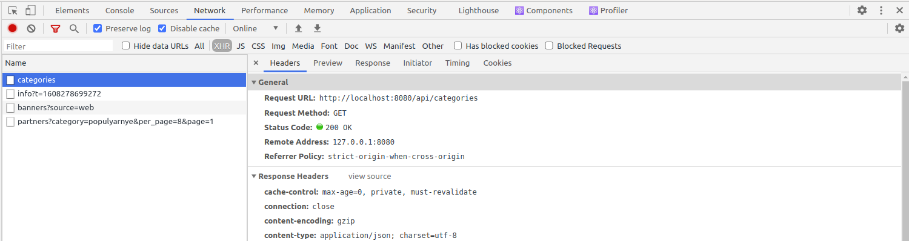

# Course Checkpoint 15

## ¿Qué es Axios?


Muchos proyectos en la web necesitan interactuar con una API REST en algún momento de su desarrollo. Axios es un cliente HTTP ligero basado en el servicio $ http dentro de Angular.js v1.x y es similar a la API de búsqueda de JavaScript nativa.

Axios se basa en promesas, lo que le brinda la capacidad de aprovechar la asincronía de JavaScript y esperar un código asincrónico más legible.

También puede interceptar y cancelar solicitudes, y hay una protección integrada en el lado del cliente contra la falsificación de solicitudes entre sitios.

En este artículo, verá ejemplos de cómo usar Axios para acceder a la popular API de marcador de posición JSON dentro de una aplicación React.

### Requisitos previos

Para seguir este artículo, necesitarás lo siguiente:

- Node.js versión 10.16.0 instalado en el equipo. Para instalar esto en macOS o Ubuntu 18.04, siga los pasos de Cómo instalar Node.js y Crear un entorno de desarrollo local en macOS o la sección Instalación utilizando un PPA de Cómo instalar Node.js en Ubuntu 18.04.
- Un nuevo proyecto de React configurado con Create React App siguiendo el tutorial Cómo configurar un proyecto de React con Create React App.
- También ayudará a tener una comprensión básica de JavaScript, que puede encontrar en la serie Cómo codificar en JavaScript, junto con un conocimiento básico de HTML y CSS.

### Adición de Axios al proyecto

En esta sección, agregará Axios a un proyecto React.

```Shell
npx create-react-app react-axios-example
```

Para agregar Axios al proyecto, abra el terminal y cambie los directorios en el proyecto:

```Shell
cd react-axios-example
```

A continuación, ejecute este comando para instalar Axios:

```Shell
npm install axios@0.24.0
```

A continuación, deberá importar Axios en el archivo en el que desea usarlo.

### Realización de una solicitud GET

En este ejemplo, se crea un nuevo componente y se importa Axios en él para enviar una solicitud GET.

Dentro de tu proyecto de React, necesitarás crear un nuevo componente llamado PersonList.

Primero, cree un nuevo subdirectorio de componentes en el directorio src:

```Shell
mkdir src/components
```

En este directorio, cree PersonList.js y agregue el siguiente código al componente:

src/components/PersonList.js

```JavaScript
import React from 'react';
import axios from 'axios';

export default class PersonList extends React.Component {
  state = {
    persons: []
  }

  componentDidMount() {
    axios.get(`https://jsonplaceholder.typicode.com/users`)
      .then(res => {
        const persons = res.data;
        this.setState({ persons });
      })
  }

  render() {
    return (
      <ul>
        {
          this.state.persons
            .map(person =>
              <li key={person.id}>{person.name}</li>
            )
        }
      </ul>
    )
  }
}
```

Primero, importa React y Axios para que ambos se puedan usar en el componente. A continuación, se conecta al enlace del ciclo de vida de componentDidMount y realiza una solicitud GET.

Utiliza axios.get (url) con una URL de un punto final de API para obtener una promesa que devuelve un objeto de respuesta. Dentro del objeto de respuesta, hay datos que luego se asignan al valor de persona.

También puede obtener otra información sobre la solicitud, como el código de estado en res.status o más información dentro de res.request.

Añade este componente a tu app.js:

src/app.js

```JavaScript
import PersonList from './components/PersonList.js';

function App() {
  return (
    <div ClassName="App">
      <PersonList/>
    </div>
  )
}
```

A continuación, ejecute la aplicación:

```Shell
npm start
```

Ver la aplicación en el navegador. Se le presentará una lista de 10 nombres.

### Realización de una solicitud POST

En este paso, utilizará Axios con otro método de solicitud HTTP denominado POST.

Dentro de tu proyecto de React, necesitarás crear un nuevo componente llamado PersonAdd.

Cree PersonAdd.js y agregue el siguiente código para crear un formulario que permita la entrada del usuario y, posteriormente, publique el contenido en una API:

src/components/PersonAdd.js

```JavaScript
import React from 'react';
import axios from 'axios';

export default class PersonAdd extends React.Component {
  state = {
    name: ''
  }

  handleChange = event => {
    this.setState({ name: event.target.value });
  }

  handleSubmit = event => {
    event.preventDefault();

    const user = {
      name: this.state.name
    };

    axios.post(`https://jsonplaceholder.typicode.com/users`, { user })
      .then(res => {
        console.log(res);
        console.log(res.data);
      })
  }

  render() {
    return (
      <div>
        <form onSubmit={this.handleSubmit}>
          <label>
            Person Name:
            <input type="text" name="name" onChange={this.handleChange} />
          </label>
          <button type="submit">Add</button>
        </form>
      </div>
    )
  }
}
```

Dentro de la función handleSubmit, se impide la acción predeterminada del formulario. A continuación, actualice el estado a la entrada del usuario.

El uso de POST le proporciona el mismo objeto de respuesta con información que puede usar dentro de una llamada.

Para completar la solicitud POST, primero debe capturar la entrada del usuario. Luego agrega la entrada junto con la solicitud POST, que le dará una respuesta. A continuación, puede console.log la respuesta, que debe mostrar la entrada de usuario en el formulario.

Añade este componente a tu app.js:

src/app.js

```JavaScript
import PersonList from './components/PersonList';
import PersonAdd from './components/PersonAdd';

function App() {
  return (
    <div ClassName="App">
      <PersonAdd/>
      <PersonList/>
    </div>
  )
}
```

A continuación, ejecute la aplicación:

```Shell
npm start
```

Ver la aplicación en el navegador. Se le presentará un formulario para enviar nuevos usuarios. Compruebe la consola después de enviar un nuevo usuario.

### Realización de una solicitud DELETE

En este ejemplo, verá cómo eliminar elementos de una API utilizando axios.delete y pasando una URL como parámetro.

Dentro de tu proyecto de React, necesitarás crear un nuevo componente llamado PersonRemove.

Cree PersonRemove.js y agregue el código siguiente para eliminar un usuario:

src/PersonRemove.js

```JavaScript
import React from 'react';
import axios from 'axios';

export default class PersonRemove extends React.Component {
  state = {
    id: ''
  }

  handleChange = event => {
    this.setState({ id: event.target.value });
  }

  handleSubmit = event => {
    event.preventDefault();

    axios.delete(`https://jsonplaceholder.typicode.com/users/${this.state.id}`)
      .then(res => {
        console.log(res);
        console.log(res.data);
      })
  }

  render() {
    return (
      <div>
        <form onSubmit={this.handleSubmit}>
          <label>
            Person ID:
            <input type="number" name="id" onChange={this.handleChange} />
          </label>
          <button type="submit">Delete</button>
        </form>
      </div>
    )
  }
}
```

De nuevo, el objeto res le proporciona información sobre la solicitud. A continuación, puede console.log esa información de nuevo después de enviar el formulario.

Añade este componente a tu app.js:

src/app.js

```JavaScript
import PersonList from './components/PersonList';
import PersonAdd from './components/PersonAdd';
import PersonRemove from './components/PersonRemove';

function App() {
  return (
    <div ClassName="App">
      <PersonAdd/>
      <PersonList/>
      <PersonRemove/>
    </div>
  )
}
```

A continuación, ejecute la aplicación:

```JavaScript
npm start
```

Ver la aplicación en el navegador. Se le presentará un formulario para eliminar usuarios.

### Uso de una instancia base en Axios

En este ejemplo, verá cómo puede configurar una instancia base en la que puede definir una dirección URL y cualquier otro elemento de configuración.

Cree un archivo independiente llamado api.js:

src/api.js

```JavaScript
import axios from 'axios';

export default axios.create({
  baseURL: `http://jsonplaceholder.typicode.com/`
});
```

Una vez configurada la instancia predeterminada, se puede utilizar dentro del componente PersonRemove. La nueva instancia se importa así:

src/components/PersonRemove.js

```JavaScript
import React from 'react';

import API from '../api';

export default class PersonRemove extends React.Component {
  // ...

  handleSubmit = event => {
    event.preventDefault();

    API.delete(`users/${this.state.id}`)
      .then(res => {
        console.log(res);
        console.log(res.data);
      })
  }

  // ...
}
```

Debido a http://jsonplaceholder.typicode.com/ ahora es la URL base, ya no necesita escribir la URL completa cada vez que desee llegar a un punto final diferente en la API.

### Usar async y await

En este ejemplo, verá cómo puede usar async y esperar a trabajar con promesas.

La palabra clave wait resuelve la promesa y devuelve el valor. El valor se puede asignar a una variable.

src/components/PersonRemove.js

```JavaScript
import React from 'react';

import API from '../api';

export default class PersonRemove extends React.Component {
  // ...

  handleSubmit = event => {
    event.preventDefault();

    const response = await API.delete(`users/${this.state.id}`);

    console.log(response);
    console.log(response.data);
  }

  // ...
}
```

En este ejemplo de código, se reemplaza el .then (). La promesa se resuelve y el valor se almacena dentro de la variable de respuesta.

## ¿Qué es una variable en SCSS? Y su funcionalidad


Una de las herramientas más simples pero potentes en SASS son las variables. Son simples en su esencia, pero hacen la vida muy fácil con el apoyo del proyecto.

Con las variables puede deshacerse de la duplicación de código. Veamos cómo funciona esto en el ejemplo de creación de una combinación de colores del proyecto. Tomemos algunos colores básicos que queremos usar:

- Oscuro - # 303846
- Luz - # f7f7f7
- Principal - # 09d3ac
- Secundaria - # 2196f3

Ahora, al principio de nuestro archivo SASS, podemos declarar las variables y escribir estos valores en ellas. Para ello se utiliza el símbolo $ y se especifica un nombre único.

```SCSS
$dark: #303846;
$light: #f7f7f7;
$primary: #09d3ac;
$secondary: #2196f3;
```

Ahora podemos usar estos colores en cualquier parte de nuestro proyecto simplemente abordándolos por su nombre.

```SCSS
.card {
  background: $light;
  border: 1px solid $dark;
}
```

La compilación resultará en el siguiente código CSS:

```CSS
.card {
  background: #f7f7f7;
  border: 1px solid #303846;
}
```

Tenga en cuenta que, al igual que los selectores de plantillas, las variables no entran en nuestro archivo CSS después de la compilación. Sólo se utilizan dentro del archivo SASS, lo que ayuda a evitar el exceso de información dentro del CSS.

Muchos pueden objetar que las variables ya existen en la CSS y su uso es similar al descrito anteriormente. Usted tendrá razón - en CSS ahora es posible administrar los colores exactamente de la misma manera. Pero al mismo tiempo aparecen valores superfluos y el uso mismo de variables es un poco más complejo de lo que sucede en los preprocesadores. También es importante entender la diferencia de variables en SASS y en CSS. Las variables en CSS existen en «tiempo presente», es decir, se encuentran en un archivo CSS, se pueden cambiar directamente a CSS y los navegadores se refieren constantemente a ellas cuando es necesario. Las variables en SASS desaparecen después de la compilación, y en su lugar en CSS simplemente substituyen los valores.


### Ámbito de visibilidad

La variable se puede declarar tanto dentro como fuera del seleccionador. Dependiendo de dónde se haya declarado la variable, puede usarse en todo el proyecto o solo dentro de un selector específico. Vea un ejemplo de este código:

```SCSS
$margin-top: 20px;

.card {
  $bg-color: #f9f9f9;
}

.wrapper {
  margin-top: $margin-top;
  background: $bg-color;
}
```

En este caso, hemos anunciado dos variables: $ margin-top y $ bg-color. Posteriormente, ambas variables se utilizaron en el selector .wrapper. ¿Qué va a pasar después de la compilación? De hecho, no habrá compilación. Recibiremos un mensaje de error:

```
Error: Undefined variable.
  ╷
9 │   background: $bg-color;
  │               ^^^^^^^^^
  ╵
```

El compilador nos dice que se utiliza una variable desconocida en la línea 9. Pero la tenemos, la anunciamos en 4 línea. Sí - realmente hay una variable $ bg-color en el código, pero sólo existe dentro del selector .card y fuera de este selector es simplemente invisible.

Este comportamiento se denomina dominio de visibilidad de la variable. Dependiendo de dónde declaremos la variable, podemos acceder a ella o a todo el proyecto, o solo dentro de un selector. La variable $ margin-top en este ejemplo es una variable global, ya que hay acceso a ella en cualquier parte de nuestro archivo SASS. La variable $ bg-color del ejemplo es una variable local y sólo está disponible dentro del selector donde se definió.

Tomemos otro ejemplo:

```SCSS
.card {
  $main-bg: #f9f9f9;
  $header-bg: #2196f3;

  .card-header {
    background: $header-bg;
  }

  .card-body {
    background: $main-bg;
  }
}
```

Tenga en cuenta que las variables $ main-bg y $ header-bg están declaradas dentro del selector .card. Dado que los selectores .card-header y .card-body se encuentran dentro del selector .card, las variables $ main-bg y $ header-bg estarán disponibles para estos selectores. Después de la compilación, obtendremos el siguiente código CSS:

```CSS
.card .card-header {
  background: #2196f3;
}

.card .card-body {
  background: #f9f9f9;
}
```

### Nomenclatura de variables

Como se mencionó anteriormente, los nombres de las variables deben ser únicos. Esta regla se crea para evitar posibles errores. Después de todo, la variable global y local puede tener el mismo nombre. Intentemos añadir una variable global a nuestro último ejemplo:

```SCSS
$main-bg: #f7f7f7;

.card {
  $main-bg: #f9f9f9;
  $header-bg: #2196f3;

  .card-header {
    background: $header-bg;
  }

  .card-body {
    background: $main-bg;
  }
}

.wrapper {
  background: $main-bg;
}
```

Tenga en cuenta que la variable $ main-bg también está declarada al principio del archivo SASS y en el selector .card. Lo más probable es que a primera vista no identifique qué $ main-bg se utilizará en el proyecto. Intentaremos compilar este código. Esta vez no habrá errores:

```CSS
.card .card-header {
  background: #2196f3;
}

.card .card-body {
  background: #f9f9f9;
}

.wrapper {
  background: #f7f7f7;
}
```

Creado dentro del selector .card, la variable $ main-bg realmente no tiene nada que ver con la variable global $ main-bg. Incluso siempre que tengan los mismos nombres. Pero aquí hay una confusión que puede contribuir, así que nunca use los mismos nombres para variables globales y locales.

### Conectar variables desde otro archivo

A menudo, para una organización SASS conveniente, los estilos se dividen en varios archivos independientes, dependiendo de su destino. Por ejemplo, podemos tener la siguiente estructura de archivos:

```
└── scss/
    ├── config.scss
    ├── default_variables.scss
    └── app.scss
```

En esta estructura tenemos el archivo principal app.scss, en el que queremos conectar la configuración del archivo configur.scss y la configuración estándar de las variables del archivo default_variables.scss. Puede conectar estos archivos a un archivo app.scss mediante la directiva @ nat, especificando la ruta al archivo requerido:

```SCSS
@import "config.scss";
@import "default_variables.scss";
```

También es opcional especificar una extensión cuando se conectan archivos SASS. El compilador encontrará el archivo necesario en el directorio especificado y lo conectará. Así que podemos reescribir un poco el código y no especificar una extensión extra:

```SCSS
@import "config";
@import "default_variables";
```

El orden de conexión de los archivos es muy importante en este caso. Si hay valores conflictivos dentro de los ficheros config.scss y default_variables.scss, se tomará el que se especificó en el último. Aquí funciona la misma regla de cascada que en CSS: los estilos grabados más tarde tienen mayor prioridad.

### Indicador default

Volvamos a la estructura de nuestro proyecto. En default_variables.scss nota los colores básicos para nuestro proyecto:

```SCSS
$primary: #A0D788;
$secondary: #71D0A7;
$third: #CCD47D;
```

Ahora, al conectar el archivo a nuestro archivo de estilo principal, podemos usar estas variables. Utilizamos los colores del archivo app.scss:

```SCSS
@import "config";
@import "default_variables";

.card {
  background: $primary;

  .btn {
    background: $secondary;
  }
}
```

Una vez compilado, obtendremos el siguiente código CSS:

```CSS
.card {
  background: #A0D788;
}

.card .btn {
  background: #71D0A7;
}
```

Pasa un tiempo, nuestro fichero con las variables crece. Probablemente, hasta lo usamos como el paquete en muchos proyectos (por ejemplo, el fichero parecido es en фреймворке Bootstrap) y había de repente un deseo de cambiar el color básico. Esto es absolutamente normal, y todos los proyectos espera tal etapa.

Si cambiamos el color directamente en el fichero default_variables.scss, recibiremos el resultado, necesario a nosotros. Pero a veces tal acceso no trabaja. Presentaremos que usamos tal fichero en forma del paquete, que es cargado de afuera. En este caso no podemos recibir la renovación, habiendo cambiado el significado en el fichero local. Nuestro fichero es ya no idéntico al que está situado en el servidor general.

¡Decidir este problema ayuda la bandera especial! default. La bandera dada es sacada después del significado de la variable y habla sobre lo que es necesario usar el significado por reticencia solamente en caso de que antes el significado de la variable no era indicado. ¡Pondremos para nuestro esquema de color la bandera! default:

```SCSS
$primary: #A0D788!default;
$secondary: #71D0A7!default;
$third: #CCD47D!default;
```

Ahora, si agregamos la variable $ primary al archivo configur.scss, es su valor el que se utilizará como color de fondo para el selector .card:

config.scss

```SCSS
$primary: #09D3AC;
```

default_variables.scss

```SCSS
$primary: #A0D788!default;
$secondary: #71D0A7!default;
$third: #CCD47D!default;
```

app.scss

```SCSS
@import "config";
@import "default_variables";

.card {
  background: $primary;

  .btn {
    background: $secondary;
  }
}
```

Después de compilar este código, obtendremos el siguiente resultado:

```CSS
.card {
  background: #09D3AC;
}

.card .btn {
  background: #71D0A7;
}
```

## ¿Por qué son útiles las herramientas de desarrollo de React en el navegador?


### ¿Por qué tiene que depurar las aplicaciones React?

Depuración es una de las habilidades más útiles que un desarrollador puede tener. Permite navegar rápida y eficientemente y encontrar errores en el código. En la web moderna es posible gracias al uso de diversas herramientas y técnicas.

React es una de las bibliotecas de front-end que más rápido se desarrolla. Permite crear fácilmente interfaces de usuario complejas e interactivas. Al igual que otras bibliotecas y frameworks, tiene un conjunto de herramientas de depuración, llamadas tools de desarrollo de React.

### ¿Qué son los React DevTools?

Las Herramientas de Desarrollo de Aprox son una extensión de navegador disponible para Chrome, Firefox y como una aplicación independiente que le permite inspeccionar la jerarquía de componentes de React en las herramientas del desarrollador de Chrome. Proporciona un conjunto adicional de widgets de inspección específicos de React para ayudar en el desarrollo. Desde su creación, el equipo de desarrollo ha lanzado muchos lanzamientos.

En este material voy a demostrar varias maneras de aprovechar sus capacidades para mejorar la depuración de las aplicaciones React con él.

### Cómo instalar React DevTools

React DevTools está disponible como una extensión para Chrome y Firefox. Si ya ha instalado la extensión, debe actualizarse automáticamente. Si utiliza un shell sin conexión (por ejemplo, en React Native o Safari), puede instalar una nueva versión desde NPM:

```
npm install -g react-devtools@^4
```

### React DevTools mejora el rendimiento

DevTools ofrece importantes ganancias de rendimiento y una navegación mejorada. Algunos aspectos se han modificado para que sea fácil de usar en aplicaciones más grandes.

### Filtrado de componentes con React DevTools

En versiones anteriores de DevTools, navegar por grandes listas de componentes era un poco tedioso. Pero ahora DevTools ofrece la capacidad de filtrar componentes para ocultar aquellos que no te interesan.

Para acceder a esta función, filtremos los tres componentes.


Para filtrar el componente y centrarse en el componente que nos interesa, haga clic en el icono de configuración debajo de la ficha Componentes. Aparecerá una ventana emergente delante de usted. Haga clic en la ficha Componentes y seleccione la opción de ordenación preferida.


Una vez que hemos filtrado los componentes, se vuelven ocultos por defecto, pero una vez que el filtro está apagado, se vuelven visibles. Esta función es útil si está trabajando en un proyecto con muchos componentes y la clasificación rápida se convierte en una necesidad real. Lo más interesante es que la configuración del filtro se recuerda entre las sesiones de trabajo.

### Las props integradas en React DevTools son cosa del pasado

Para facilitar la visualización de grandes árboles de componentes y acelerar el funcionamiento de DevTools, los componentes del árbol ya no muestran las props integradas.

Para ver esta función en la acción, basta con seleccionar el componente y todos sus props, state y hooks aparecerán en el lado derecho de la consola.

En nuestro ejemplo de aplicación, pasamos los datos sólo al componente contacts. Al hacer clic en él, verás el valor del prop que se le ha pasado y al hacer clic en otros componentes verás que los props no se les han pasado.


Si bien esta característica puede no ser tan útil para los pequeños proyectos React, es útil cuando se trabaja con grandes proyectos React.

### Depuración de los valores inesperados de los componentes y de los elementos de prop

Consideremos la siguiente clase React:

```JavaScript
import ABC from 'abc';
import XYZ from 'xyz';

class Main extends Component {
  constructor(props) {
    super(props);

    this.state = { name : "John" }
 }
 render() {
    const { name } = this.state;
      return (
        <ABC>
          <XYZ name={name} />
        </ABC>
      )
  }
}
```

ABC es el padre de XYZ, pero Main es el propietario del componente, y sólo los propietarios pueden enviar props hacia abajo.

En Aprox Dev, puede depurar rápidamente el valor inesperado prop saltándose a sus padres. En DevTools v4 se ha añadido una lista renderizada por el panel derecho que le permite ver rápidamente la lista de propietarios para acelerar el proceso de depuración.

Al hacer clic en cualquiera de los componentes de nuestra aplicación, podemos ver los componentes que los han mostrado. Esto es muy útil cuando se trata de rastrear el origen de un prop específico.


También viene con una función inversa llamada owners tree. Esta es una lista de lo que es rendido por un componente específico - lo que «posee». Esta vista es similar a ver el origen de un método de renderizado de componentes y puede ser una forma útil de explorar las grandes y desconocidas aplicaciones de React.

Para utilizar esta función para depurar la aplicación, haga doble clic en el componente para ver el árbol de propietarios y haga clic en el botón «x» para volver al árbol de componentes completo. También puede desplazarse por el árbol para ver todos los hijos del componente.


### Mejoras visuales en React DevTools

#### Representación de componentes con sangría

En versiones anteriores de React DevTools, se requería desplazamiento vertical y horizontal para ver componentes profundamente anidados, lo que dificultaba el seguimiento de grandes árboles de componentes. DevTools ahora ajusta dinámicamente las sangrías en los componentes anidados para eliminar el desplazamiento horizontal.

Para usar esta función en nuestra aplicación, haga clic en la ficha de componentes, luego haga clic en cualquier componente y todos sus componentes secundarios aparecerán automáticamente debajo de él con una sangría automática del siguiente componente.


#### Búsqueda mejorada

Anteriormente, cuando se buscaba en DevTools, el resultado era a menudo un árbol de componentes filtrado que mostraba los nodos coincidentes como raíces, es decir, otros componentes estaban ocultos y la coincidencia de búsqueda ahora se mostraba como elementos raíz.

Ahora puede buscar fácilmente en sus componentes con la visualización de resultados en una línea, como una búsqueda en un navegador.


### Mejoras funcionales en React DevTools

#### Mejor soporte para hooks

Los proyectos de React basados en hooks se pueden depurar más rápido y mejor, tienen el mismo nivel de soporte que props y state.


#### Restaurar selección entre reinicios

Durante la depuración, al hacer clic en el botón de reinicio, DevTools intenta restaurar el último elemento seleccionado.

Supongamos que hemos ordenado el componente Personas en nuestra aplicación de ejemplo antes de que se produzca la actualización de página, DevTools reanudará con el componente Personas seleccionado automáticamente.


### Cambiar modo de espera

La API Suspense en React permite a los componentes «esperar» o hacer «algo» antes de renderizarse. Puede utilizar los componentes < Suspense > para determinar el estado de carga cuando los componentes situados más profundamente en el árbol están pendientes de renderizado.

DevTools le permite probar estos estados de carga con este interruptor:


### Cambios en el profiler en React DevTools

#### Reinicio y perfil

El perfilador es una poderosa herramienta para personalizar el rendimiento de los componentes de React. Legacy DevTools era compatible con el perfilado, pero sólo después de descubrir una versión adecuada de React que soportaba el perfilado. Debido a esto, no había forma de perfilar el mount inicial (una de las partes más sensibles al rendimiento) de la aplicación.

Esta función ya se admite con la acción «reiniciar y perfilar»:


#### Lista de renders de componentes

El perfilador muestra una lista de todos los casos de renderizado del componente seleccionado durante la sesión de perfilado, así como la duración de cada renderizado. Puede utilizar esta lista para desplazarse rápidamente entre los comandos al analizar el rendimiento de componentes específicos.

Para nuestro ejemplo de aplicación, vemos que algunos componentes se muestran dos veces durante la sección, ahora tenemos una dirección de depuración que puede potencialmente mejorar el rendimiento.


## ¿Qué es el debugger en JavaScript? ¿Cómo se utiliza?


### Por qué necesitamos DevTools y cómo usarlos

El código JS cliente se interpreta y ejecuta en los navegadores, por lo que incorporan herramientas para desarrolladores (DevTools). Ayudan a monitorear y estudiar las opciones que caracterizan el estado de una página web en el momento actual o antes. También existe la posibilidad de suspender y continuar la ejecución del código, navegar por él y mucho más. Afortunadamente para los desarrolladores web, DevTools de los navegadores modernos (Chrome, Firefox y Safari) tienen una estructura similar y se abren de la misma manera. Por lo tanto, incluso si ha utilizado Chrome toda su vida al abrir las herramientas de desarrollador en Safari, será capaz de dominar lo suficientemente rápido.

#### Pila de tecnología utilizada

Aunque HTML, CSS y JavaScript son la «Santísima Trinidad» del desarrollo web, pocos aplican el JS puro para construir grandes aplicaciones SPA. Bibliotecas, marcos y utilidades aportan sus características a la estructura del código y al proyecto en general. En nuestra empresa, casi todo el desarrollo se lleva a cabo con el uso de React, que se ensambla en un único JS-bandl con Webpack, y a esto tiende a atornillarse el Hot Module Reload. A continuación, vamos a considerar todo en el contexto de esta pila.

#### Inicio

Puede abrir las herramientas para desarrolladores desde el menú contextual o mediante el método abreviado de teclado. Para salir del menú contextual, haga clic con el botón secundario del mouse (ratón) en la página y seleccione Inspectar.

Para depurar el código JavaScript, las pestañas Console, Sources y Network serán las más útiles. Tenga en cuenta que las herramientas de los desarrolladores pueden incluir no sólo las propias herramientas del navegador, sino también herramientas adicionales de las extensiones. Así, en la imagen que aparece a continuación, las pestañas Componentes y Perfil pertenecen a la extensión de Herramientas de Desarrollo de React.


#### Exploramos la ficha Consola

La consola realiza dos grandes tareas:

1. Muestra mensajes de diferentes niveles: errores, advertencias, información de carácter general.
2. Genera y ejecuta código JS, es decir, funciona en formato REPL.

Y si la segunda función no es tan a menudo necesaria para depurar errores, la primera ayuda a detectarlos rápidamente. Así puede parecer una consola en un proyecto típico:


Como se puede ver en la captura de pantalla, puede haber muchas cosas: avisos de navegador, mensajes de información de webpack-dev-server y hot-module-replacement, registros de accesos a API (si ha configurado la salida a la consola), errores de conexión de red. Para simplificar la percepción de la información, es útil cortar niveles de lógica innecesarios. Para ello, abra el selecto de niveles predeterminados y seleccione sólo el que desee. Por ejemplo, sólo puede dejar errores o advertencias:


#### Exploramos la pestaña Fuentes

La pestaña Fuentes se utiliza normalmente para depurar proyectos grandes y complejos. En los navegadores Firefox y Safari, una pestaña similar se llama Debugger. Con ella se pueden explorar aquellos recursos (scripts, imágenes, archivos de estilo) a los que la página tiene acceso. Normalmente, este acceso se puede obtener como resultado de la descarga de un recurso a través de la red, pero algunas herramientas, como Webpack, inyectan sus propios recursos.

En la captura de pantalla a continuación, la pestaña Fuentes en Chrome 86. En el lado izquierdo se encuentra la sección de selección del recurso que desea mostrar, que tiene una estructura de árbol. Centralmente, la ventana de visualización del recurso seleccionado y, a la derecha, las herramientas de depuración de scripts JS. En nuestro ejemplo, el proyecto se ejecuta localmente a través de webpack-dev-server y está disponible en http ://localhost: 8080:


Como se puede ver en la captura de pantalla, el archivo app.js que contiene JS-bandl está ahora abierto. Este archivo es el resultado del trabajo del recopilador (Webpack), es el que el navegador descarga cuando se abre una página HTML indexada. El archivo es grande y buscar algo al respecto es difícil, ya que reúne todos los módulos del proyecto, y encima Webpack agregó su fleje. Afortunadamente, con el desarrollo local, puede ver los componentes de forma rápida y cómoda.

#### Acceso rápido a componentes y módulos

En el árbol de recursos, hay una sección webpack ://en la parte izquierda del panel Fuentes. Debido a los sorsmaps (sourcemaps, mapas de código), esta sección proporciona acceso a los módulos y componentes originales del proyecto y, de hecho, repite la estructura de archivos del proyecto de la manera en que lo ve en su IDE o editor.


Tenga en cuenta que no es necesario buscar la pieza responsable del módulo main.jsx en la banda general app.js. En su lugar, puede abrir el componente main.jsx inmediatamente y ver su contenido en la vista original, es decir. Si hay un módulo separado en su proyecto, pero no está conectado en ninguna parte, entonces no lo encontrará en la estructura de la partición webpack ://, ya que Webpack no sabrá nada al respecto si no importa el módulo.

#### Transición rápida al módulo por nombre de archivo

Debido a que la estructura de los grandes proyectos es casi siempre compleja y ramificada, encontrar el módulo adecuado en el árbol de componentes puede ser tedioso. En este caso, el método abreviado Ctrl + O (Ctrl + P) en Chrome/Firefox y Cmd + Mayús + O en Safari viene a ayudar. Al pulsar las teclas se abre un popup en el que se puede encontrar el componente por el nombre del archivo y ir rápidamente a él.

#### Exploramos la pestaña Red

Todas o casi todas las aplicaciones web acceden a recursos externos a través de la red, es decir, realizan consultas de red. Ejemplos de tales consultas son: obtener un archivo estático (script JS, archivos con estilos CSS), acceder a un servidor backend a través de la API React. La pestaña Red le permite obtener información bastante completa sobre las solicitudes de red que realiza una página en un momento determinado.


La parte principal de la pestaña Network es una tabla en la que la información de las consultas realizadas se ajusta dinámicamente. Una fila de tabla corresponde a una consulta. Hay herramientas adicionales sobre la tabla para controlar el registro y mostrar consultas de red. Como se puede ver en la captura de pantalla, las columnas de la tabla proporcionan al desarrollador información sobre cada solicitud registrada: por ejemplo, puede ver con qué código HTTP terminó la consulta, conocer el tipo MIME del recurso solicitado y cuánto tiempo tardó en ejecutarse la solicitud.

Las columnas de la tabla, excepto la columna Nombre, son personalizables: puede ocultar las que no sean necesarias y agregar otras adicionales. Para personalizar las columnas mostradas, haga clic con el botón secundario del ratón en la tapa de la tabla y marque las opciones que desee en la lista.


Dado que una página Web puede realizar un gran número de consultas, los desarrolladores obtienen la función de filtrado que proporciona la ficha Red. Muy conveniente y muy probablemente el más popular es el filtro por tipo de recurso (enmarcado en rojo). Por ejemplo, en la captura de pantalla sólo se ha seleccionado mostrar solicitudes XHR:


A menudo, la página no solo accede a sus propios recursos, sino también a terceros, como scripts de análisis. Puede excluir la visualización de consultas a recursos externos mediante el campo Filtro que admite algunas palabras clave para filtrar. Por lo tanto, puede especificar dominio: yourdomain.com para muestrear consultas por nombre de dominio:


Más palabras clave para el campo Filtro en Google Chrome se puede encontrar en la página https://developers.google.com/web/tools/chrome-devtools/network/reference#filter-by-property.

Si hace clic en el nombre del recurso solicitado en la columna Nombre, se abrirá un panel en el lado derecho de la ficha con información detallada sobre la consulta seleccionada. Puede ver los encabezados transferidos y recibidos, el cuerpo de la respuesta, la hora en que se realizó la solicitud y otros.



La sección Vista previa muestra el cuerpo de la respuesta en forma humana, lo que puede ser importante cuando se depuran las solicitudes de cliente a servidor. En la captura de pantalla, la respuesta del servidor obtenida en formato application/json se presenta como un objeto cuyos campos se pueden revelar y estudiar.


Las cajas de comprobación de registros de Preserve (en algunos navegadores de registros de Perist) y de caché Disable también son importantes al depurar:

- El checkbox de Preserve logs guarda la información básica de las solicitudes al reiniciar la página o al redirigir a otro sitio.
- La caja de comprobación de caché desactivada desactiva el almacenamiento en caché de recursos mientras están abiertas las herramientas del desarrollador. Para obtener una versión actualizada de los recursos solicitados durante el proceso de desarrollo, se recomienda activar siempre esta opción.

### Bloquear errores de la consola

Consideremos este ejemplo:

```JavaScript
class CategoryList extends React.Component {
 constructor(props) {
   super(props);

   this.state = {
    categories: undefined, // <--- должно быть "categories: []"
   };
 }

 mapCategoriesFromState() {
   const mapped = this.state.categories.map(mapFn); // <--- вызываем метод ".map"

   this.setState({
    categories: mapped,
   });
 }

 render() {
   this.mapCategoriesFromState();
   return 'Hello';
 }
}
```

Aquí se encuentra un error claro - el desarrollador olvidó que no declaró categorías como una matriz, e intenta llamar al método .map. Se observará un mensaje de vista en la consola:

```
category-list.jsx:11 Uncaught TypeError: Cannot read property 'map' of undefined
 at CategoryList.mapCategoriesFromState (category-list.jsx:11) <--- ошибка здесь
 at CategoryList.render (category-list.jsx:19)
 at finishClassComponent (react-dom.development.js:14742)
 at updateClassComponent (react-dom.development.js:14697)
 at beginWork (react-dom.development.js:15645)
 at performUnitOfWork (react-dom.development.js:19313)
 at workLoop (react-dom.development.js:19353)
 at HTMLUnknownElement.callCallback (react-dom.development.js:150)
 at Object.invokeGuardedCallbackDev (react-dom.development.js:200)
```

El mensaje consiste en el texto de error (Uncaught TypeError: Cannot read property 'map' of undefined) y una estectrace desde la que se puede ver claramente que se ha producido un error en el método mapCategoriesFromState de la clase CategoryList en la línea 11 del archivo category-list.jsx. Esto ya es suficiente para abrir el lugar indicado en el código y analizar cómo salió así.

Adicionalmente React proporciona su propio estectrace, no enfocado en los archivos en sí, sino en la cadena de componentes, empezando por la raíz. De esta manera, se puede rastrear toda la rama de componentes que resultó ser un error. Teniendo en cuenta los otros componentes de React, su mensaje se verá así:

```
The above error occurred in the <CategoryList> component:
 in CategoryList (created by Connect(CategoryList))
 in Connect(CategoryList) (created by MainApp)
 in OfferProvider (created by Connect(OfferProvider))
 in Connect(OfferProvider) (created by MainApp)
 in MainApp (created by Connect(MainApp))
 in Connect(MainApp) (created by Context.Consumer)
 in Route (created by App)
 in Switch (created by App)
 in Router (created by BrowserRouter)
 in BrowserRouter (created by App)
 in Provider (created by App)
 in App (created by HotExportedApp)
 in AppContainer (created by HotExportedApp)
 in HotExportedApp
```

### Cargamos el proyecto con el depurador

Tratar con un error del ejemplo anterior era bastante sencillo: tanto el error en sí como la causa que lo causa están en el mismo archivo, por lo que no es difícil establecer una relación causal, basta con ver el código. Pero la era de las aplicaciones SPA y los frameworks trajo consigo toneladas de código que interactúa entre sí, que además está dividido en módulos-archivos. En estas condiciones, es difícil determinar la causa del error de un mensaje en la consola, y es casi irreal atrapar y reparar un error en una lógica empresarial en la que la consola está vacía. Un depurador ayudará aquí.

#### Qué puede depurar en las herramientas del desarrollador

Características básicas del depurador:

- suspender la ejecución del código;
- moverse por código (ejecución paso a paso);
- comprobar el valor de las variables;
- ver los controladores de eventos añadidos (event listener handlers);
- editar el código o los valores de las variables sobre la marcha.

Por supuesto, no es toda la lista de capacidades del depurador, pero para la mayoría de las tareas, esto suele ser suficiente.

La idea de depurar es encontrar el error en una situación en la que no está del todo claro qué buscar y dónde. Para ello se utilizan puntos de interrupción (breakpoints, breakpoints): es el lugar del código donde el depurador suspenderá automáticamente la ejecución de JavaScript.

El depurador del navegador admite varios tipos de rompimientos:

- El rompimiento en la línea de código se activa cuando el intérprete de JS llega a la cadena especificada.
- El rompimiento condicional en la línea de código se activa bajo la condición especificada.
- El breakpoint en el nodo DOM se activa cuando se cambia este nodo.
- El breakpoint en una solicitud XHR se activa en una solicitud de red específica.
- El breakpoint en el evento se dispara en su ofensiva.

También puede crear un punto de lógica. No interrumpe la ejecución del código, pero permite establecer un argumento para console.log que se llamará en la línea especificada.

La mayor parte del proceso de depuración es lo siguiente:

1. Ponemos breakpoints en los lugares correctos.
2. Observamos el valor de las variables o comprobamos el orden en que se ejecuta el código.
3. Navegamos por el código o ponemos nuevos breakpoints y comprobamos qué datos contienen el código en un momento determinado y cómo se utilizan.

#### Manipulación de rompecabezas

Para poner el rompimiento:

- seleccione el script que desee en el árbol de recursos situado en la parte izquierda del panel Fuentes;
- haga clic con el botón izquierdo del ratón en el número que indica el número de línea, a la izquierda del código.

Si hace clic no con el botón izquierdo sino con el botón derecho del ratón, aparecerá un menú contextual para seleccionar el tipo de punto de ruptura: normal, condicional o de lógica.

Después, se creará un punto de interrupción en la fila especificada y el número de fila se iluminará en azul, mientras que en el lado derecho del panel aparecerá una nueva entrada en la lista Breakpoints que indica el rompimiento creado. Ahora, si actualiza la página, la ejecución del código se detendrá en la línea especificada.


Acciones que se pueden realizar con un rompimiento después de la instalación:

- Quitar haciendo clic con el botón izquierdo del ratón en el número de línea.
- Desactivar temporalmente (ignorar) quitando la casilla opuesta al punto de quiebre de la lista Breakpoints del lado derecho.
- Cambiar de tipo pulsando con el botón derecho del ratón y seleccionando Editar breakpoint en el menú contextual.

#### Mover código

La función más útil del depurador es la depuración paso a paso. Esta función permite ejecutar código de una línea a la vez.

Supongamos que tenemos un componente React que recibe algunas props. Después de montar el componente, debe realizar algunas acciones, ya sea para acceder a la API, actualizar el estado del componente en sí o algo, pero por alguna razón nada funciona. El primer paso, por supuesto, es poner un breakpoint en el lugar en el que asumes el problema. Después de pausar la ejecución del código en la ubicación seleccionada, puede comenzar a navegar por el código más allá, explorando el estado actual de las variables y los resultados de la llamada a funciones.

Los botones de flecha resaltados en el cuadro rojo de la captura de pantalla permiten navegar por el código:


- Botón Resume script execution. El título habla por sí mismo: el código seguirá ejecutándose hasta el siguiente punto de interrupción o hasta que se ejecuten todas las instrucciones del script.

- Botón Step over next function call. Al hacer clic, el depurador ejecuta la instrucción en la línea actual y pasa a la siguiente. En este caso, si se ha especificado una llamada a la función en la línea de rompimiento, el depurador no entrará en ella.

- El botón Step into the next function call será útil si la cadena actual contiene una llamada a la función y necesita entrar dentro de esa función. En la captura de pantalla, al hacer clic en este botón se traducirá el depurador dentro de la función this.isUnkownCategory ().


- El botón Step out of current function te ayudará si entras en una función pero te das cuenta de que no hay nada que hacer en ella. El depurador ejecutará automáticamente más instrucciones dentro de la función actual y saldrá de ella. En el ejemplo siguiente, al hacer clic en el botón se devolverá el depurador a componentDidMount:


Los botones Step over, Step into, Step out están presentes en los depuradores Chrome, Firefox y Safari. Google agregó el cuarto botón Step a Chrome. En funcionalidad es similar al botón Step into, la única diferencia es cómo manejan la ejecución de funciones asíncronas.

#### Investigación de código

Un conjunto de paneles situados en el lado derecho del depurador será útil para investigar el código. Lo más habitual es acceder al panel Scope, que permite realizar un seguimiento de las variables de la aplicación y ver su valor en el momento actual.


Tenga en cuenta que el panel Scope tiene varias pestañas que muestran variables del área de visibilidad local (Local), el área de cierre (Closure) y el área de visibilidad global (Global). También puede cambiar el valor de las variables: haga doble clic en el valor de la variable en el panel Scope e introduzca un nuevo valor.

Si el componente React es el contexto de ejecución actual, es conveniente que el panel Scope supervise su estado actual y el valor de las variables locales. La captura de pantalla muestra que en este momento el valor de esta es una instancia de la clase MainLayout. Y si es necesario estudiar qué props se transfieren a un componente o qué se encuentra en this.state, es fácil hacerlo a través de Scope.


A veces hay que depurar una función que se llama muchas veces, pero hay que cogerla en un determinado estado. Para ello, puede utilizar ConditionalBreakpoint. Por ejemplo, el método this.loadNext se llama en diferentes momentos, pero en lugar de continuar y detener la ejecución muchas veces con el botón Resume Script Execution, puede engancharse al valor de la variable loadType. Entonces el rompimiento solo funcionará en el momento adecuado.


